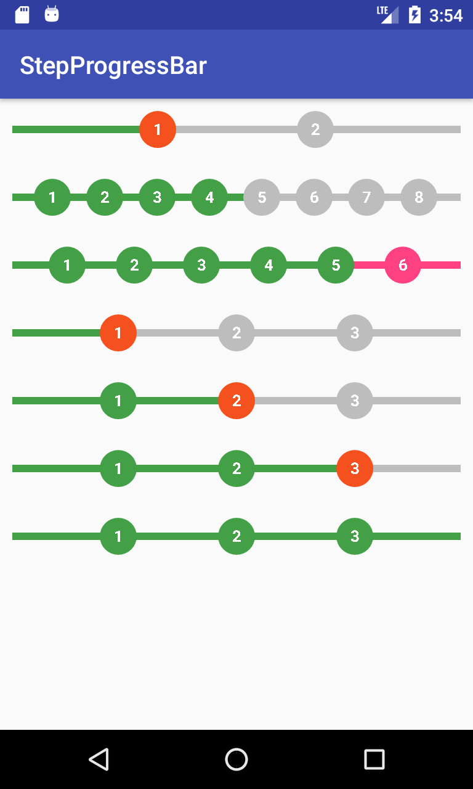

# StepProgressBar
A Progress Bar with Step Points

Android does not provide a progress bar with step points.  To create one using Views and ViewGroups can be very costly as well as time consuming.
This custom View provides a very stripped down solution by providing one flat View which draws a progress bar and the amount of step points you wish to add directly to the canvas.

Screenshot below (low res)

By default the steps increment.  So if you require 4 steps just add the total amount of progress points and the numbers will auto populate.  

TO USE:

The functionality is VERY sparse as this view was created for one sole purpose.  IF any users would like a more complex version then please request it and I'll see what I can do :)

